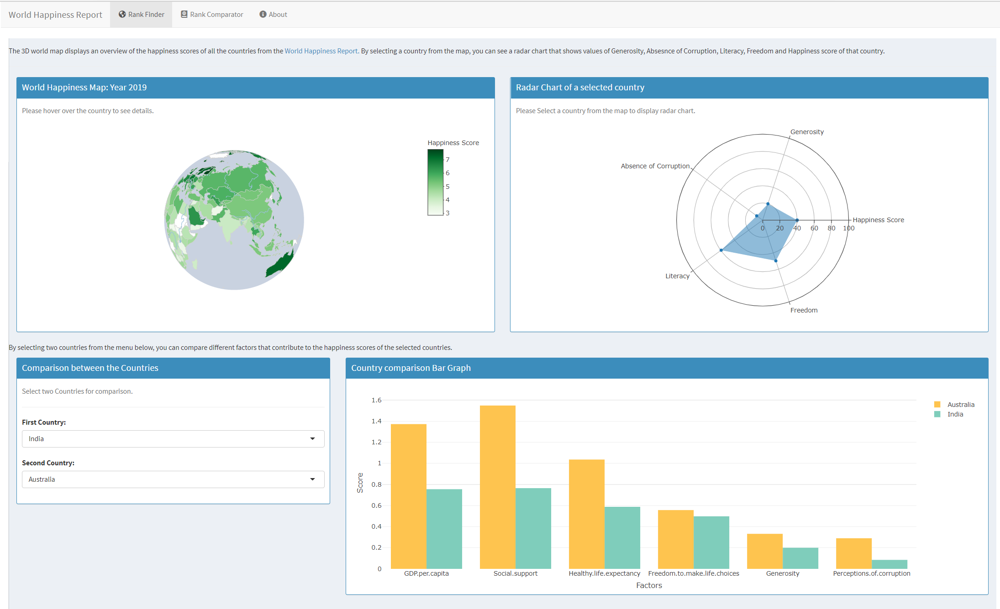
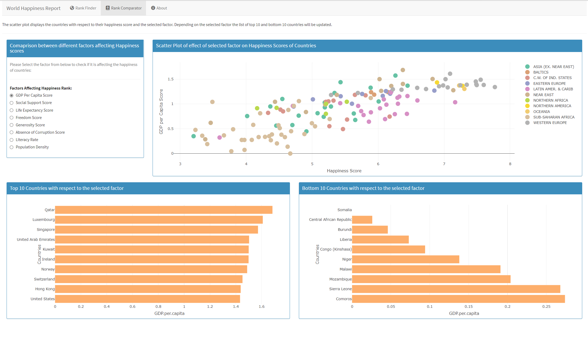

# WorldHappinessVis
The world happiness resolution was started by the UN general assembly in 2011, to guide the public policy they invited the member countries to measure the happiness of their people. The first World Happiness Report was released on April 1, 2012 which drew international attention. The report highlighted the state of world happiness through several case studies and explained the reasons for happiness and misery. In 2013 the second happiness report was released and from 2015 it became a annual thing. The report basically uses the Gallup World poll data, and the reports can be viewed on the World Happiness Report. The progress of nations is assessed by the experts in fields of psychology, economics, survey analysis and national statistics.

The World Happiness report of 2019 ranks 156 countries by their happiness levels. The report specifies six key variables that support well being of the nations. Those six variables are income, social support, freedom, trust, healthy life expectancy and generosity. Each variable measured reveals a populated-weighted average score on a scale running from 0 to 10 that is tracked over time and compared against other countries. These variables currently include: real GDP per capita, social support, healthy life expectancy, freedom to make life choices, generosity, and perceptions of corruption for the 2019 report. For the purpose of analysis apart from the six variables we have added extra measures of countries like population, population density and literacy to check if we can derive a relation between these factors and the happiness rank of each nation.

